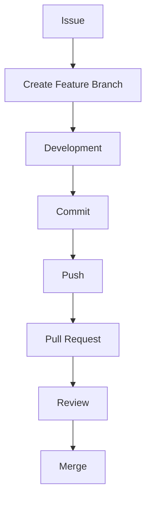

# Contributing to CODEXEDOC

First off, thank you for your interest in contributing! 

CODEXEDOC is an open-source learning platform. Its purpose is not to create educational content, but rather to provide the infrastructure and tools that help users create, organize, review, and master their own knowledge. We are transitioning into a community-driven open-source project, and we want your contributor experience to be simple, welcoming, and professional.

---

## Contributor License Agreement

By submitting a pull request, you certify that:

- You wrote the contributed code or have the legal right to contribute it.
- Your contribution may be distributed under the GNU Affero General Public License v3.0 (AGPL-3.0).
- You understand your contribution becomes part of the CODEXEDOC project and will remain licensed under the AGPL.

By opening a pull request, you agree to these terms.

---

## Before You Start

Before diving into the code, we recommend taking a moment to:

- **Check existing Issues:** Ensure someone isn't already working on the problem you found.
- **Search Discussions:** Your idea or question might have already been discussed.
- **Read relevant ADRs:** Architecture Decision Records (ADRs) outline our technical decisions. Read them before making architectural changes.
- **Discuss large changes:** If you're working on a significant feature or refactor, start a discussion before implementing it.
- **Claim an issue:** If you'd like to work on an existing issue, leave a comment so others know it's being worked on.

---

## Development Setup

To get started, follow the installation instructions in the project's **README.md**.

Contributors should fully configure their local development environment before starting. If you do not have production credentials, you can run the project in **Community Mode**. This allows you to develop and test features locally without needing access to external production integrations.

---

## Development Workflow

Our contributor workflow is designed to be straightforward.

---

## Branch Naming

We use descriptive branch names to keep our repository organized. 

Recommended format:

- `feature/dashboard`
- `feature/reviews`
- `feature/goals`
- `feature/auth`
- `fix/navbar`
- `docs/architecture`
- `refactor/reviews`
- `chore/dependencies`

Descriptive branch names are preferred over simple issue numbers because they help everyone understand the purpose of the branch at a glance.

---

## Commit Messages

We strictly follow the [Conventional Commits](https://www.conventionalcommits.org/) specification. This helps us generate automated changelogs and trace project history clearly.

**Examples:**

- `feat(goals): add study session`
- `fix(auth): prevent redirect loop`
- `docs(architecture): add ADR-002`
- `refactor(reviews): simplify review service`
- `chore(deps): update dependencies`

---

## Pull Requests

When you are ready to share your work, open a Pull Request.

**PR Checklist:**

- **Describe changes:** Clearly explain what your PR does and why.
- **Link Issues:** Reference any related issues (e.g., "Fixes #123").
- **Update documentation when necessary:** Keep `README.md` and other docs up to date.
- **Keep PRs focused:** Limit your PR to a single feature or bug fix.
- **Request review:** Tag a core contributor or maintainer for review.
- **Respond to feedback professionally:** Collaborate with reviewers to polish your code. Ensure all checks pass.

---

## Code Style

We maintain high standards for code quality to keep the project sustainable.

- **Use TypeScript:** We strictly use TypeScript. 
- **Prefer reusable components:** Build UI elements that can be shared across the application.
- **Avoid unnecessary complexity:** Keep logic straightforward.
- **Follow existing conventions:** Stick to the established patterns in the codebase.
- **Write self-documenting code:** Use meaningful variables and function names.
- **Keep functions small:** Break down large blocks of logic.
- **Run lint before submitting:** Always run our linting scripts locally before pushing your code.

---

## Documentation

Documentation is a first-class citizen in CODEXEDOC. You should update or add documentation when introducing a:

- **New feature** (update user guides or the README).
- **Architecture change** (propose or update an ADR).
- **New workflow** or process.
- **Public API** or widely used internal interface.

---

## Communication

Good communication is essential. Here is where we discuss things:

- **GitHub Issues:** For actionable tasks, clear feature requests, and bug reports.
- **GitHub Discussions:** For broader ideas, Q&A, and general conversations.
- **Discord:** For real-time chat and community building.
- **Architecture discussions:** Should always happen in Discussions or Issues (via ADR proposals) before any code is written.

**When to ask questions:**
Don't hesitate to ask if you've spent more than a reasonable amount of time stuck on a problem!

---

## Community Roles

Our project thrives on a structured contributor progression:

- **Community Contributor:** Submits issues, fixes bugs, improves docs, and participates in discussions.
- **Core Contributor:** Experienced contributors who understand the codebase deeply, review PRs, and guide others.
- **Maintainer:** Responsible for the strategic direction, final PR approvals, and releases.
- **Founder / COO:** Oversees the project's long-term vision, governance, and organizational operations.

*(For a deeper dive into these roles and the promotion paths, see our Contributor Workflow ADR).*

---

## Need Help?

We want your contribution experience to be fantastic. If you ever get stuck, need clarification on an issue, or just want to introduce yourself, please drop a message in our Discord, or leave a comment on the GitHub issue you are working on. We're here to help!