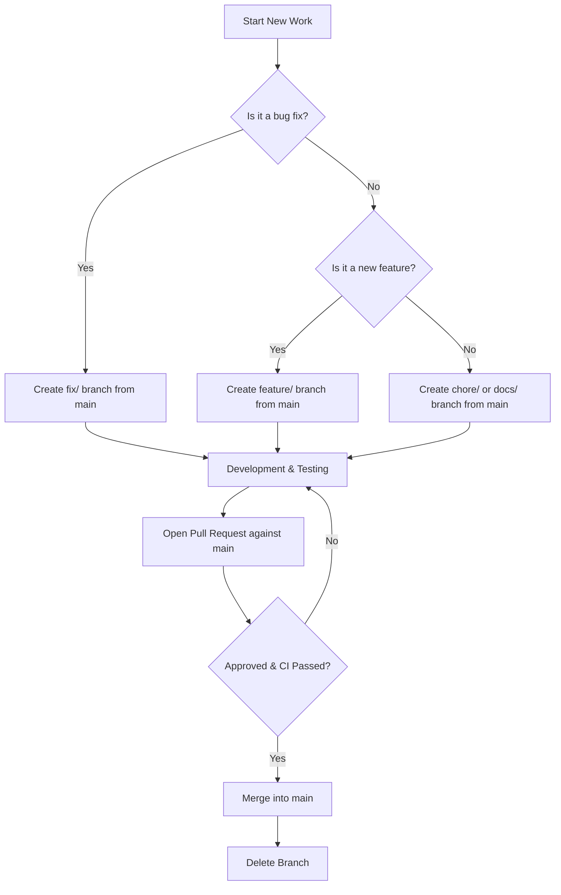
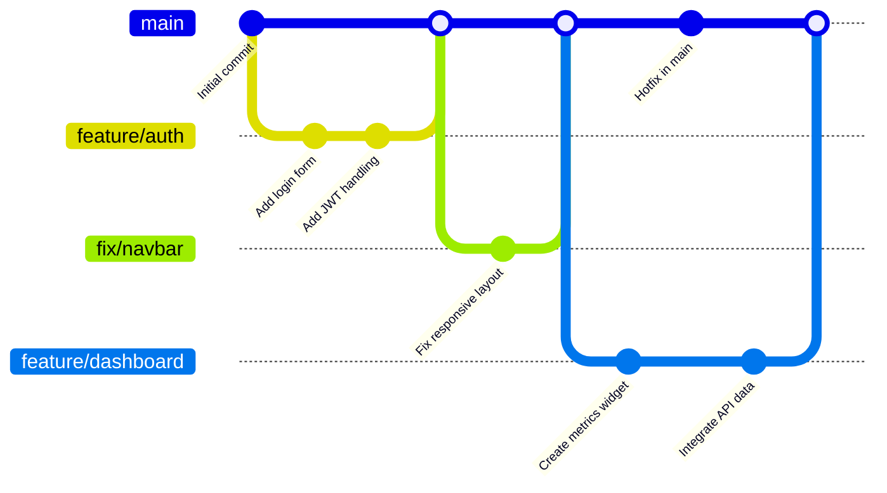
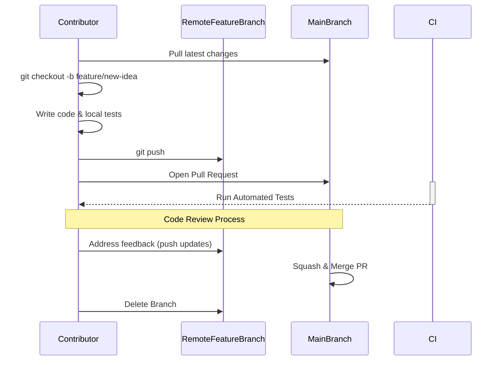
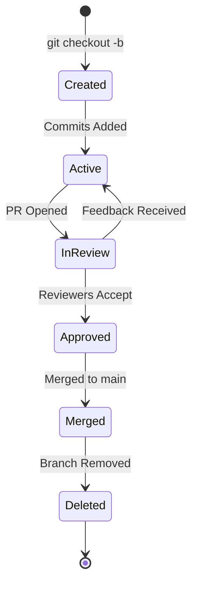

# Title

Migration to Single Source of Truth Branching Strategy

# Status

Accepted

# Date

2026-07-29

# Authors

Founder & COO

# Context

As CODEXEDOC has evolved into a robust open-source learning platform, our development workflows have naturally grown more complex. Historically, the repository has relied on two long-lived branches: `main` and `mock`. 

The `mock` branch was originally created out of a necessity to protect sensitive production environment variables. At the inception of the project, it provided a safe, isolated environment where contributors could develop and test features without requiring access to production credentials or live databases. Initially, this strategy worked exceptionally well. It lowered the barrier to entry for new developers, provided a sandbox environment, and prevented accidental modifications to production data.

However, over time, the maintenance of this dual-branch system has become increasingly untenable. Because `main` and `mock` exist in parallel as long-lived branches, they have evolved independently. Functions have been renamed in one branch but not the other, directory structures have diverged, and core business logic has split into separate implementations. 

This divergence has transformed what was once a protective measure into a significant bottleneck. Merging changes between the two branches has become a complex, error-prone process. The architecture no longer scales with our growing contributor base, as the cognitive overhead of understanding which branch holds the "correct" implementation slows down development and frustrates contributors.

## Problem Statement

The current branching architecture suffers from several critical flaws:

- **Long-lived branches:** Maintaining both `main` and `mock` indefinitely violates the principle of continuous integration, leading to massive integration pain and delayed feedback cycles.
- **Different implementations:** Code in `mock` often utilizes different function names, mock data structures, and architectural patterns compared to `main`.
- **Duplicate maintenance:** Contributors are frequently forced to write a feature twice—once for the mock environment and once for production—doubling the workload.
- **Merge conflicts:** The severe divergence between the branches results in complex merge conflicts that require deep domain knowledge to resolve safely.
- **Difficult onboarding:** New open-source contributors struggle to understand the repository structure, unsure of where to base their work or how to test it correctly.

# Decision

We are migrating CODEXEDOC to a **Single Source of Truth** branching architecture. 

Moving forward, the permanent `mock` branch will be deprecated and removed. All development will revolve around `main` as the sole, definitive source of truth. Contributors will work exclusively using short-lived feature branches created directly from `main`. 

The core tenets of this decision are:
- **Feature branches created from `main`:** All new work begins from the latest `main` commit.
- **One feature per branch:** Branches must be tightly scoped to a single logical change or feature.
- **Small Pull Requests:** We mandate small, incremental Pull Requests to facilitate swift and effective code reviews.
- **Delete branches after merge:** Once a feature branch is merged into `main`, it must be deleted immediately to maintain a clean repository.
- **`main` always remains the source of truth:** `main` must always be in a deployable state and represents the current official state of the software.

# Why this decision

Transitioning to a single source of truth is a fundamental step in maturing our engineering practices. 

- **Maintainability:** By eliminating the `mock` branch, we instantly remove the burden of duplicate maintenance. There is only one implementation of any given function, making the codebase significantly easier to navigate and maintain.
- **Scalability:** As we grow our open-source community, a standard, predictable workflow is essential. Short-lived feature branches scale infinitely with the number of contributors, preventing the bottleneck of a single integration branch.
- **Collaboration:** Working off a unified `main` branch ensures that all developers are looking at the same code. This fosters better communication, prevents duplicated effort, and aligns the team.
- **Code Review:** Mandating small Pull Requests directly to `main` drastically improves the quality of code reviews. Reviewers can focus on the specific logic of a feature without being bogged down by massive structural diffs.
- **Smaller merge conflicts:** Because feature branches are short-lived, the delta between the branch and `main` remains small. This fundamentally reduces the likelihood and severity of merge conflicts.
- **Developer productivity:** Developers will spend less time resolving conflicts and backporting changes, and more time building features that bring value to the CODEXEDOC platform.
- **Open source best practices:** This model heavily aligns with GitHub Flow, the industry standard for modern, collaborative open-source projects. Adopting this standard makes it immediately familiar to external contributors.

# Alternatives Considered

During the evaluation of our branching strategy, we considered several alternatives:

1. **Keeping `mock` forever:** 
   - *Description:* Continuing with the current dual-branch system.
   - *Result:* **Rejected.** The compounding technical debt, divergence of code, and overhead of duplicate maintenance make this approach unscalable and detrimental to developer velocity.

2. **Git Flow:**
   - *Description:* A strict branching model featuring `main`, `develop`, `release`, `hotfix`, and `feature` branches.
   - *Result:* **Rejected.** Git Flow is overly complex for our current needs and introduces unnecessary overhead for a continuous delivery web application. The heavy reliance on a long-lived `develop` branch would recreate many of our current integration issues.

3. **GitHub Flow:**
   - *Description:* A lightweight, branch-based workflow where all feature branches are created from `main`, reviewed via Pull Requests, and merged back into `main`.
   - *Result:* **Accepted.** This is effectively the model we are adopting. It is simple, highly effective for continuous deployment, and universally understood in the open-source ecosystem.

4. **Fork-based workflow:**
   - *Description:* Contributors fork the repository and submit Pull Requests from their forks to the upstream `main`.
   - *Result:* **Accepted for external contributors.** While core maintainers will use feature branches within the main repository, the underlying principle remains identical: all work targets the single source of truth, `main`.

# Advantages

- **Unambiguous Source of Truth:** Unambiguous clarity on the official state of the codebase at any given moment.
- **High Familiarity:** Aligns perfectly with industry-standard open-source workflows, drastically reducing onboarding friction for new contributors.
- **Increased Velocity:** Faster integration cycles due to smaller, more frequent merges instead of massive batch updates.
- **Enhanced Quality:** Higher quality code reviews as PRs are smaller and highly focused on specific deliverables.
- **Clean Git History:** Deleting branches after merging keeps the repository history pristine and searchable.
- **CI/CD Alignment:** Perfectly sets the stage for robust Continuous Integration and Continuous Deployment pipelines running directly against `main`.

# Disadvantages

- **Local Environment Complexity:** Without a dedicated `mock` branch, developers must rely on local `.env` files, mock service workers (e.g., MSW), or Dockerized local databases to simulate production without requiring actual production credentials. This requires a more robust initial setup for local development.
- **Discipline Required:** This strategy relies heavily on developer discipline to keep branches short-lived and PRs small. If developers hold onto branches for too long, the benefits are negated.

# Future Evolution

This branching strategy is designed to be foundational and will evolve alongside the project:

- **Community contributors:** As external contributions increase, we will strictly enforce the Fork-based workflow, ensuring the main repository remains clean while still merging everything exclusively into `main`.
- **Core contributors:** Core team members will continue utilizing repository-local feature branches to enable faster collaboration and pair programming on branches before merging.
- **CI/CD:** We will implement automated pipelines that deploy every merge to `main` directly to a staging environment, ensuring `main` is perpetually release-ready.
- **Protected branches:** `main` will be strictly protected. Direct commits will be disabled, and merging will require passing CI checks and approvals from code owners.
- **Automatic checks:** We will integrate automated linting, testing, and security scanning on every Pull Request to enforce quality standards before a merge is permitted.

# Migration Plan

To transition safely to this new architecture without disrupting ongoing work or risking code loss, we will execute the following step-by-step migration plan. **Note: This phase involves only architectural shifts, not code rewriting.**

1. **Documentation First:** Merge this ADR and update the architectural README to communicate the upcoming change to all contributors.
2. **Feature Freeze on `mock`:** Announce a date where no new features will be accepted into the `mock` branch.
3. **Audit Divergence:** Core maintainers will conduct a final audit to identify any critical functionality present in `mock` that is missing or differs in `main`.
4. **Final Sync:** Create a comprehensive Pull Request to backport required changes, mock data structures, or local environment configurations from `mock` to `main`.
5. **Local Development Setup:** Document the new local development environment setup (e.g., using `.env.local` or Docker) to replace the reliance on the `mock` branch.
6. **Deprecate `mock`:** Lock the `mock` branch, marking it as read-only.
7. **Archive and Delete:** After a brief observation period to ensure stability, archive the `mock` branch state via a git tag and permanently delete the branch from the remote repository.

# Branch Naming Convention

To maintain a clean and understandable repository, all branches must adhere to the following naming conventions based on the type of work being performed:

- `feature/dashboard`
- `feature/reviews`
- `feature/auth`
- `feature/knowledge`
- `fix/navbar`
- `fix/auth`
- `docs/architecture`
- `docs/readme`
- `refactor/goals`
- `refactor/reviews`
- `chore/dependencies`

# Commit Convention

We strongly recommend adhering to the **Conventional Commits** specification. This provides a lightweight convention on top of commit messages, creating an explicit history that makes it easy to write automated tools.

**Examples:**
- `feat(auth): implement OAuth2 login flow`
- `fix(dashboard): resolve layout shift on mobile devices`
- `docs(architecture): add ADR for branching strategy`
- `refactor(api): extract user validation logic to middleware`
- `chore(deps): update React to version 18`

# Pull Request Flow

The standard workflow for implementing changes is as follows:

Create Issue
↓
Create Branch
↓
Development
↓
Push
↓
Open Pull Request
↓
Review
↓
Merge
↓
Delete Branch

# Git Examples

Below is a typical sequence of Git commands following this new strategy:

```bash
git checkout -b feature/dashboard
git add .
git commit -m "feat: add user dashboard skeleton"
git push -u origin feature/dashboard
```

# Best Practices

To ensure this branching strategy succeeds, contributors must adhere to the following recommendations:

1. Always branch from `main`. Never branch from another feature branch unless absolutely necessary.
2. Keep branches short-lived. Aim to merge branches within a few days of creation.
3. Scope PRs tightly. A Pull Request should address exactly one issue or feature.
4. Pull frequently. Regularly merge or rebase `main` into your feature branch to prevent severe conflicts later.
5. Write descriptive PR titles. Use the PR title to clearly state what the change does.
6. Provide context in PR descriptions. Explain *why* the change is being made and link to the relevant issue.
7. Review your own PR first. Catch obvious mistakes before requesting a review from others.
8. Automate everything. Rely on CI for formatting, linting, and testing—not human reviewers.
9. Never force push to `main`. `main` history must remain immutable.
10. Delete branches promptly. Keep the branch list clean to reduce cognitive load.
11. Draft PRs for early feedback. Open a Draft PR if you want architectural feedback before the code is finished.
12. Resolve conversations. Ensure all reviewer comments are addressed and resolved before merging.
13. Don't mix refactoring with features. If a feature requires a refactor, do the refactor in a separate PR first.
14. Keep local environments updated. Regularly update your local dependencies and database schemas to match `main`.
15. Communicate. If a branch is taking longer than expected, communicate with the team to see if it can be broken down.

# Anti-Patterns

Avoid these common mistakes, which undermine the single source of truth architecture:

- **The "Everything" Branch:** Creating a branch named `feature/ui-updates` and working on it for a month, modifying 50 different files across the application.
- **Branching from a Branch:** Creating `feature/reviews-enhancement` from `feature/reviews` before the latter is merged into `main`, creating a brittle dependency chain.
- **Ignoring `main`:** Working on a feature branch for two weeks without ever pulling down the latest changes from `main`.
- **Leaving Stale Branches:** Merging a PR but leaving the branch alive on the remote server indefinitely.
- **Testing in Production:** Bypassing local development setups and pushing directly to `main` to see if a change works.

# Mermaid Diagrams

## Flowchart



## Git graph



## Contributor workflow



## Branch lifecycle


