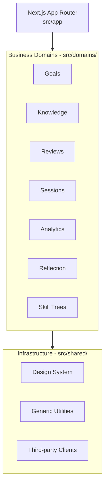
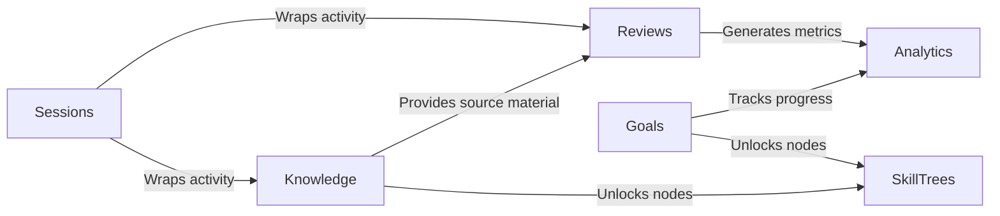
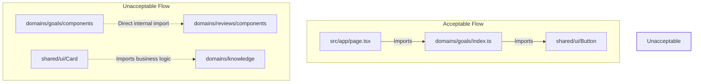
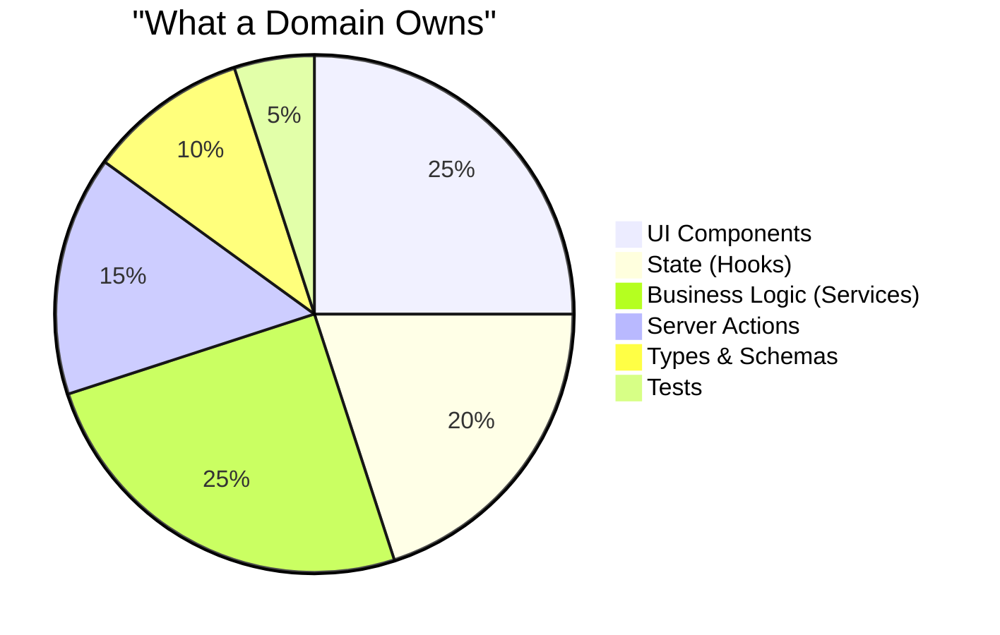

# ADR 003: Project Structure

# Status

Accepted

# Date

2026-07-28

# Authors

Founder & COO

---

## Context

The physical organization of code—the project structure—is one of the most critical architectural decisions for a growing software platform. It establishes the foundational boundaries, implicitly guides developer behavior, and significantly impacts the maintainability and velocity of the project.

As a software project grows from an initial prototype to a complex, feature-rich application, the cognitive load on developers increases exponentially. When files are organized strictly by their technical type (e.g., all components together, all hooks together), the natural business boundaries become obfuscated. Developers are forced to maintain mental maps of how disparate technical artifacts relate to form a cohesive business feature.

Furthermore, a well-defined project structure acts as the first point of onboarding for new contributors. A structure that maps directly to the product's business domains provides immediate context, allowing contributors to quickly orient themselves, understand the system's capabilities, and safely introduce changes with minimal unintended side effects.

## Problem Statement

The current iteration of the CODEXEDOC project relies on a traditional, technical-layered folder organization. Files are grouped by their technical role:
- `components/`
- `hooks/`
- `actions/`
- `utils/`
- `lib/`
- `services/`

While this approach is conventional and functional for small-scale applications, it presents severe limitations as the platform scales:
- **Large technical folders**: Folders like `components` and `hooks` become massive dumping grounds. Finding a specific file requires significant effort or reliance on IDE search.
- **Difficult navigation**: To understand a single feature (e.g., "Goals"), a developer must navigate across `components/goals`, `hooks/useGoals`, `actions/goalsActions`, and `services/goalsService`.
- **Hidden dependencies**: With logic scattered, it becomes trivial to accidentally couple features together, violating domain boundaries without realizing it.
- **Cross-domain coupling**: Because there are no explicit domain boundaries, it is easy for the "Reviews" system to tightly couple with the "Skill Trees" system, making them impossible to test, refactor, or extract independently.
- **Merge conflicts**: Multiple developers working on distinct features often need to modify shared technical folders (e.g., a shared `utils/` or a central `actions/` folder), increasing the likelihood of painful merge conflicts.
- **Poor ownership**: When code is organized by type, it is unclear who owns a particular business capability. Technical layers obscure business responsibility.

## Decision

The CODEXEDOC project will transition from a technical-layered architecture to a **Domain-Driven project structure**.

The project will organize source code around business domains rather than technical categories. Every business capability will own its own code, encapsulating all the technical artifacts required to fulfill its responsibility.

"Ownership" in this context means that a domain directory (e.g., `goals/`) contains its own UI components, state management hooks, server actions, services, type definitions, and tests. If an artifact is specific to the "Goals" domain, it lives inside the "Goals" directory.

## Domain Architecture

The application will be divided into the following logical business domains, directly reflecting the product vision:

### Goals
- **Purpose**: Managing user objectives and milestones.
- **Responsibilities**: Creating, tracking, and completing learning goals.
- **Typical contents**: Goal creation forms, progress tracking components, goal state management.
- **Boundaries**: Operates independently but may emit events when a goal is achieved.

### Knowledge
- **Purpose**: The core repository for user knowledge and notes.
- **Responsibilities**: Organizing, structuring, and retrieving user-generated knowledge.
- **Typical contents**: Note editors, knowledge graph visualizations, folder/tag management.
- **Boundaries**: Serves as the foundational data layer that other domains (like Reviews) may reference.

### Reviews
- **Purpose**: Spaced repetition and knowledge retention.
- **Responsibilities**: Scheduling reviews, presenting flashcards/quizzes, calculating retention metrics.
- **Typical contents**: Spaced repetition algorithms, review session UIs, card grading logic.
- **Interaction**: Heavily interacts with the Knowledge domain to source review material.

### Learning Sessions
- **Purpose**: Active, focused periods of learning.
- **Responsibilities**: Timers, focus modes, session tracking, and distraction management.
- **Typical contents**: Pomodoro timers, session analytics, focus UI wrappers.
- **Boundaries**: Wraps other domains (like Knowledge or Reviews) during an active session.

### Analytics
- **Purpose**: Insights into learning habits and progress.
- **Responsibilities**: Aggregating data, generating charts, and providing actionable feedback.
- **Typical contents**: Data visualization components, aggregation services, metric calculation.
- **Interaction**: Consumes data from Goals, Reviews, and Sessions (read-only).

### Reflection
- **Purpose**: Metacognition and qualitative self-assessment.
- **Responsibilities**: Journaling, periodic reviews (weekly/monthly), and subjective progress tracking.
- **Typical contents**: Journal editors, prompt generators, reflection history.
- **Boundaries**: Loosely coupled to other domains, providing a qualitative layer over quantitative data.

### Skill Trees
- **Purpose**: Gamified progression and structural learning paths.
- **Responsibilities**: Defining skill hierarchies, unlocking nodes, and visualizing mastery.
- **Typical contents**: Tree visualization components, node unlocking logic, mastery calculation.
- **Interaction**: Maps knowledge items and completed goals to specific skill nodes.

### Shared
- **Purpose**: Cross-cutting concerns and truly reusable infrastructure.
- **Responsibilities**: Providing a common foundation for all domains.
- **Typical contents**: Core UI design system, fundamental utilities, global configuration.
- **Boundaries**: Must never contain business logic specific to any other domain.

## Folder Structure

We will adopt a `src/domains/` architecture (direct top-level domains under `src`).

```text
CODEXEDOC/
├── src/
│   ├── app/                    # Next.js App Router (Routing only)
│   ├── domains/                # Business Domains
│   │   ├── goals/              # Domain: Goals
│   │   │   ├── components/
│   │   │   ├── hooks/
│   │   │   ├── actions/
│   │   │   ├── services/
│   │   │   ├── types.ts
│   │   │   └── index.ts        # Public API for the Goals domain
│   │   ├── knowledge/
│   │   ├── reviews/
│   │   ├── sessions/
│   │   ├── analytics/
│   │   ├── reflection/
│   │   └── skill-trees/
│   └── shared/                 # Shared Infrastructure
│       ├── ui/                 # Design System (Buttons, Inputs, Modals)
│       ├── utils/              # Generic utilities (date formatting, etc.)
│       ├── lib/                # Third-party integrations (database client, auth client)
│       └── types/              # Global types (User, AppState)
```

**Why this was selected**: Placing domains under a dedicated `src/domains/` directory provides a clear separation between the routing layer (`src/app/`), the business logic (`src/domains/`), and the generic infrastructure (`src/shared/`). This explicit separation prevents Next.js routing conventions from bleeding into business logic and ensures that the domains remain framework-agnostic where possible.

## Shared Module

The `shared/` directory is strictly reserved for code that is agnostic to the business domains. It represents the infrastructure and foundation upon which the application is built.

**What belongs in shared:**
- **UI components**: The design system (Button, Dialog, Card, Input). These components should not know anything about "Goals" or "Reviews".
- **Utilities**: Generic, pure functions (e.g., date parsing, deep cloning, math helpers).
- **Constants**: Global configuration values, theme tokens.
- **Types**: Types that cross all boundaries (e.g., base `User` interface, standard API response wrappers).
- **Configuration**: Environment variables validation, logging setup.
- **Reusable hooks**: `useMediaQuery`, `useDebounce`, `useClickOutside`.
- **Reusable services**: Database connection clients, generic HTTP clients.

**What must NEVER be placed in shared:**
- **Domain logic**: A function that calculates spaced repetition intervals belongs in `domains/reviews`, NOT `shared/utils`.
- **Domain components**: A `GoalProgressCard` belongs in `domains/goals/components`, NOT `shared/ui`.
- **Domain state**: State that is specific to a business process.

If code is only used by one domain, it belongs in that domain. If it is used by two domains, carefully consider if it should be extracted, or if one domain should expose it via its public API. Only extract to `shared` if the logic is truly generic.

## Domain Ownership

Organizing by domains enforces several key software engineering principles:

- **Single Responsibility**: A domain is responsible for one specific area of the business.
- **Feature ownership**: A team or a developer can take ownership of the "Reviews" domain, knowing exactly where all code related to reviews resides.
- **Clear boundaries**: By keeping related code together, we define clear boundaries of what a feature encompasses.
- **Low coupling**: Domains are isolated. Changes in the Goals domain are highly unlikely to break the Reviews domain.
- **High cohesion**: Code that changes together, stays together. When modifying how a goal is created, the UI, the validation schema, and the server action are all located in the same directory.

Each domain owns its logic to prevent the "spaghetti code" effect where business rules are scattered across the codebase, making the system fragile and difficult to reason about.

## Communication Between Domains

Domains must remain decoupled, but they inevitably need to interact. Communication must be deliberate and controlled.

- **Shared interfaces (Public APIs)**: Each domain should expose an `index.ts` file that acts as its public API. Other domains may only import from this `index.ts`, never from internal files deep within another domain.
- **Services**: Domains can call services exposed by other domains. For example, the `Sessions` domain might call a service exposed by the `Goals` domain to update time spent on a specific goal.
- **Events**: For looser coupling, domains can emit events (e.g., `GoalCompleted`) that other domains (like `SkillTrees`) listen to, rather than direct function calls.

**Dependencies:**
- **Acceptable**: A domain importing the design system from `shared/ui`. A domain importing a strictly typed interface from another domain's public API.
- **Unacceptable**: Circular dependencies (Domain A depends on Domain B, and Domain B depends on Domain A). This indicates a flawed boundary design and requires refactoring, potentially merging the domains or extracting a third concept.

## Migration Strategy

Transitioning to a domain-driven structure from a legacy layered architecture carries risk. The migration must be executed safely and incrementally.

- **Gradual Migration**: The migration will happen one domain at a time.
- **Avoid Big Bang Refactors**: Large-scale, full-codebase refactors halt feature development and introduce massive regressions.
- **Process**:
  1. Identify a single domain (e.g., "Goals").
  2. Create `src/domains/goals/`.
  3. Move existing Goal components, hooks, and actions into this new directory.
  4. Update imports.
  5. Test and deploy.
  6. Repeat for the next domain.
- During the migration, the legacy structure and the new structure will coexist. This is acceptable and expected.

## Advantages

- **Maintainability**: Code that belongs together is located together, making it easier to understand and update.
- **Scalability**: The architecture scales infinitely. Adding a new business feature simply means adding a new folder under `src/domains/`.
- **Developer productivity**: Reduced context switching. Developers spend less time searching for files and more time writing features.
- **Feature ownership**: Clear boundaries enable clear accountability and code ownership.
- **Reduced merge conflicts**: Developers working on different features are working in different directories.
- **Simpler navigation**: The folder structure tells the story of what the application does, not just how it is built.
- **Better onboarding**: New contributors can immediately see the business capabilities of the platform.
- **Clear responsibilities**: It is always obvious where new code should be placed.

## Disadvantages

- **Learning curve**: Requires developers to think in terms of business domains rather than technical types, which can be challenging for those accustomed to traditional structures.
- **More folders**: The total number of directories will increase, which can feel overwhelming initially.
- **Initial migration effort**: Refactoring the existing codebase requires time and careful execution.
- **Need for architectural discipline**: The architecture requires constant vigilance to prevent developers from bypassing domain boundaries or dumping code into `shared/`.

## Alternatives Considered

- **Traditional by-type organization (MVC-style)**: Retaining the existing `components/`, `hooks/`, `actions/` structure. Rejected because it fails to scale, increases cognitive load, and scatters related logic.
- **Layered architecture**: Strict separation of Presentation, Application, Domain, and Infrastructure layers. Rejected as overly complex and unnecessarily rigid for a TypeScript/React ecosystem.
- **Feature-first architecture**: Grouping by specific features (e.g., `create-goal`, `view-goal`). Rejected because features are often too granular. Domains provide a better, slightly higher-level grouping that balances cohesion and reusability.

**Why Domain-Driven fits CODEXEDOC**: CODEXEDOC is a complex platform with distinct, interrelated systems (Knowledge, Reviews, Goals). A domain-driven approach perfectly aligns the physical codebase with this mental model, ensuring the architecture remains scalable and comprehensible as the community grows.

## Future Evolution

The domain-driven architecture is highly resilient to future changes:

- **Hundreds of features**: New features are naturally contained within their respective domains or form new domains, preventing the codebase from becoming an unmanageable monolith.
- **Many contributors**: Clear boundaries minimize merge conflicts and allow parallel development across different domains.
- **Modularization/Package extraction**: If a domain (e.g., the Spaced Repetition engine in `Reviews`) becomes highly complex, its clear boundaries make it trivial to extract into a standalone NPM package or a monorepo workspace.
- **Micro-frontends**: While unlikely to be needed soon, strictly isolated domains are the prerequisite for transitioning to micro-frontends or microservices.

## Best Practices

1. **Keep domains flat**: Avoid deeply nested domain hierarchies. Prefer a wide, flat list of distinct domains.
2. **Strict Public APIs**: Use `index.ts` in each domain to explicitly export only what is intended for public consumption.
3. **No cross-domain internal imports**: Never import a file from deep inside another domain (e.g., `import { X } from 'domains/goals/components/X'`).
4. **Shared is for agnostic code only**: If it contains business logic, it does not belong in `shared`.
5. **Colocate tests**: Test files should live right next to the files they test, within the domain directory.
6. **Colocate types**: Domain-specific types belong in the domain, not in a global types file.
7. **Colocate utilities**: Helper functions specific to a domain belong in that domain's `utils/` folder.
8. **Prefix domain interfaces**: Clearly name exported interfaces to avoid collisions (e.g., `GoalData` instead of just `Data`).
9. **Use dependency injection**: Where possible, pass dependencies to services to keep them testable and decoupled.
10. **Avoid global state**: Prefer domain-level state management. Only use global state for truly cross-cutting concerns (like Authentication or Theme).
11. **Keep components dumb**: Most UI components in a domain should be purely presentational. Handle logic in hooks or container components.
12. **Validate at the boundaries**: Use schemas (e.g., Zod) to validate data entering the domain (from APIs or forms).
13. **Handle errors locally**: Domains should handle their own expected errors and only throw unexpected exceptions to global error boundaries.
14. **Document domain boundaries**: Add a `README.md` to each domain explaining its purpose and rules.
15. **Use absolute imports**: Configure paths to use absolute imports (e.g., `@/domains/goals/...`) to make moving files easier.
16. **Enforce boundaries via linting**: Use tools like ESLint (e.g., `eslint-plugin-boundaries`) to mechanically enforce import rules.
17. **Keep routing separate**: The `src/app` directory should only handle routing, loading states, and layout. It should immediately delegate to domain components.
18. **Design for deletion**: A well-structured domain should be easy to delete entirely without breaking the rest of the application.
19. **Name by business capability**: Folders should be named after what they do in the business, not their technical function.
20. **Isolate external dependencies**: If a domain relies on a specific third-party library, keep that dependency localized to the domain if possible.
21. **Prefer duplication over wrong abstraction**: It is better for two domains to have slightly similar code than to prematurely couple them through a shared utility.
22. **Keep the design system pure**: The `shared/ui` library must never import from `domains/`.
23. **Mock domain dependencies for testing**: When testing a domain, mock the services of other domains it interacts with.
24. **Review domain boundaries periodically**: As the product evolves, domains may need to be split or merged.
25. **Lead by example**: Maintainers must strictly adhere to these architectural rules to set the standard for community contributors.

## Anti-Patterns

- **God folders**: A `shared/utils` or `shared/components` folder that grows endlessly because developers are unsure where else to put code.
- **Circular dependencies**: Domain A requires Domain B, which requires Domain A. This creates a brittle, intertwined system.
- **Leaky abstractions**: Exposing a domain's internal database schema directly to other domains, forcing them to adapt to internal changes.
- **Cross-domain imports**: Directly importing internal components from another domain, bypassing the public API (`index.ts`).
- **Massive index files**: Re-exporting every single file in a domain through the `index.ts`. Only export the intended public interface.
- **Orphaned code**: Code that sits in a domain but is only ever used by a completely different domain.
- **Framework coupling**: Tying domain business logic directly to Next.js specific APIs (like `cookies()` or `headers()`) instead of injecting those dependencies.

## Mermaid Diagrams

### Architecture Overview



### Folder Hierarchy

```mermaid
classDiagram
    class src {
        +app/
        +domains/
        +shared/
    }
    class domains {
        +goals/
        +knowledge/
        +reviews/
    }
    class goals {
        +components/
        +hooks/
        +actions/
        +services/
        +index.ts
    }
    class shared {
        +ui/
        +utils/
        +types/
    }
    src *-- domains
    src *-- shared
    domains *-- goals
    goals *-- "internal structure"
```

### Domain Relationships



### Dependency Flow



### Module Ownership


