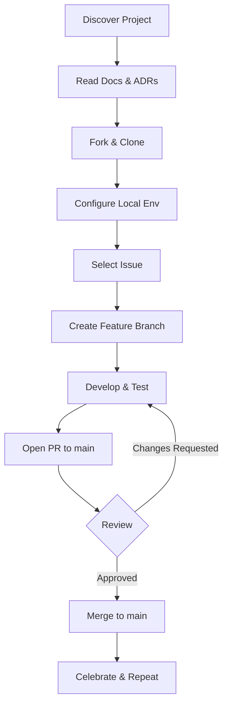
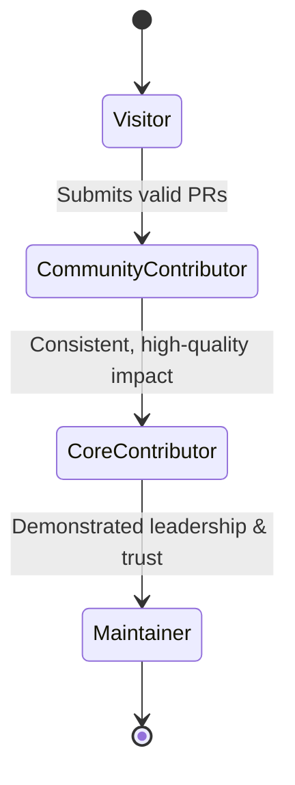
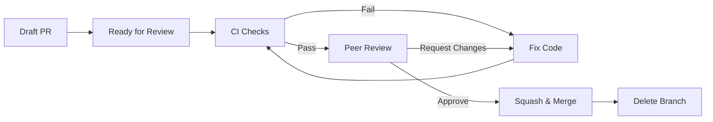
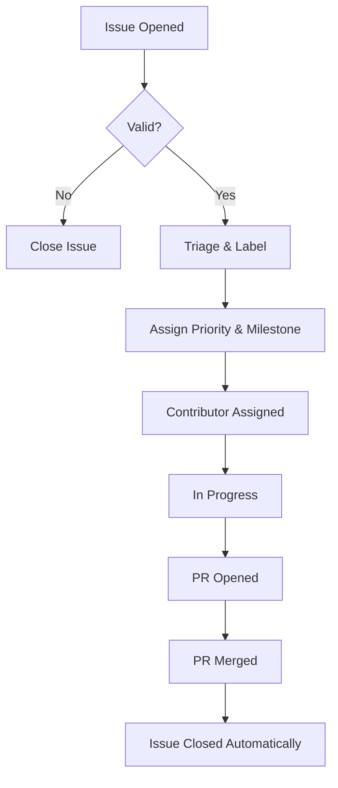
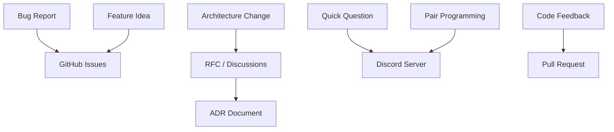
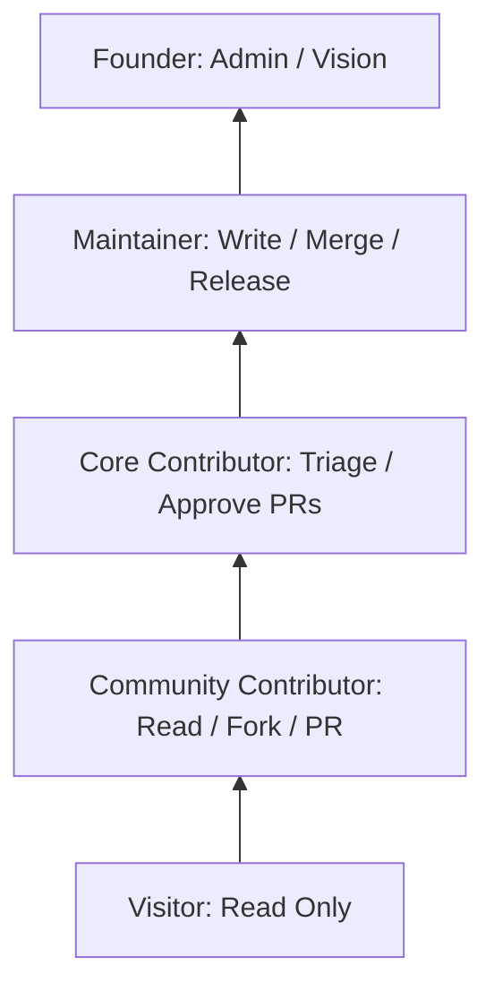

# ADR-004: Contributor Workflow

# Status

Accepted

# Date

2026-07-28

# Authors

Founder & COO

## Context

Contributor workflows are the foundational framework that dictates how an open-source project operates, scales, and sustains itself over time. As CODEXEDOC transitions from a founder-led initiative into a community-driven open-source platform, the systems we put in place to manage contributions become as critical as the software architecture itself.

A well-defined workflow directly impacts **developer experience**, reducing the friction for new contributors to join and add value. It provides **consistency**, ensuring that all code, documentation, and design changes adhere to a unified standard of quality regardless of who submits them. Furthermore, it fosters **trust**—both trust from maintainers in the contributions being made, and trust from contributors that their time and effort will be respected and efficiently reviewed. Finally, a robust contributor workflow guarantees **scalability**, allowing the community to grow from a handful of active developers to dozens or hundreds without causing administrative collapse or degrading code quality.

## Problem Statement

As projects grow, undefined or overly complex contributor workflows often lead to systemic issues that hinder community growth and project velocity. We have identified several common problems that this ADR seeks to solve:

- **Large onboarding friction:** New developers struggle to set up their environments, understand the repository structure, or find suitable first issues.
- **Unclear responsibilities:** Contributors do not know what is expected of them, what they have permission to do, or how to advance within the community.
- **Repository access confusion:** The use of long-lived "mock" or "community" branches creates confusion about where to branch from and where to merge.
- **Merge conflicts:** Maintaining separate long-lived branches inevitably leads to massive, unresolvable merge conflicts when attempting to sync with the main development line.
- **Poor communication:** Decisions are made in private channels or missing entirely, leaving community members without context on architectural direction.
- **Lack of documentation:** Undocumented processes lead to ad-hoc workflows, where every PR follows a different standard.
- **Inconsistent reviews:** Pull requests are reviewed for functional correctness but not for maintainability, architecture, or style.
- **Contributor burnout:** Complex processes, slow review cycles, and lack of recognition cause valuable contributors to leave the project.

## Decision

We will transition from a multi-branch "mock environment" model to a **unified, single-codebase workflow**.

All contributors—regardless of their level—will work from the same `main` branch. Access to protected resources, sensitive data, and production environments will be managed strictly through environment configuration and localized role-based access control, rather than through repository branching strategies.

This workflow is rooted in the principle that **trust is earned through consistent, high-quality contributions** rather than predefined repository structures. We are establishing a clear progression path that allows community members to naturally grow into core maintainership roles by demonstrating reliability, technical excellence, and cultural alignment.

## Contributor Levels

To structure community growth, we define the following contributor levels. Progression through these levels is based on merit, consistency, and adherence to our community culture.

### 1. Visitor
- **Purpose:** Individuals who use the platform, read the documentation, or passively observe the repository.
- **Responsibilities:** None formally, but encouraged to report bugs or request features.
- **Permissions:** Read access to public repositories.
- **Typical Tasks:** Opening issue tickets, reading documentation, starring the repository.
- **Promotion Criteria:** Submitting a valid Pull Request or consistently helping triage issues.
- **Expected Behavior:** Respectful communication in issues and discussions.

### 2. Community Contributor
- **Purpose:** Developers or designers who actively submit code, documentation, or design improvements.
- **Responsibilities:** Follow the contributor workflow, write clean code, add tests, and respond to review feedback.
- **Permissions:** Read access; ability to fork and submit Pull Requests.
- **Typical Tasks:** Fixing bugs, implementing small features, improving documentation, writing tests.
- **Promotion Criteria:** Consistent history of high-quality PRs, good communication, and demonstrated understanding of the project's architecture.
- **Expected Behavior:** Receptiveness to feedback, adherence to coding standards, and proactive communication.

### 3. Core Contributor
- **Purpose:** Trusted community members who deeply understand the codebase and help guide development.
- **Responsibilities:** Implement complex features, participate in architecture discussions, help onboard new contributors, and perform initial PR reviews.
- **Permissions:** Triage access (can label/assign issues), ability to approve PRs (though merge rights may still be restricted).
- **Typical Tasks:** Architectural refactoring, reviewing community PRs, managing issue backlogs, authoring RFCs.
- **Promotion Criteria:** Sustained dedication, high technical proficiency, mentorship of others, and strong alignment with project goals.
- **Expected Behavior:** Taking ownership of specific domains, mentoring community contributors, and upholding architectural integrity.

### 4. Maintainer
- **Purpose:** Leaders responsible for the strategic direction, health, and security of the project.
- **Responsibilities:** Final code reviews, merging PRs, managing releases, resolving conflicts, and setting technical direction.
- **Permissions:** Write/Admin access to the repository; ability to merge PRs and manage repository settings.
- **Typical Tasks:** Final architectural approvals, cutting releases, managing CI/CD pipelines, enforcing community guidelines.
- **Promotion Criteria:** Exceptional trust, deep architectural knowledge, proven leadership, and long-term commitment.
- **Expected Behavior:** Servant leadership, prioritizing project health over personal preference, and transparent decision-making.

### 5. Founder
- **Purpose:** Originator of the project, focusing on long-term vision and product strategy.
- **Responsibilities:** Defining the product roadmap, ensuring the open-source mission is fulfilled, and acting as the final escalation point for vision-related disputes.
- **Permissions:** Admin/Owner access.
- **Typical Tasks:** Strategic planning, community building, resource allocation.
- **Expected Behavior:** Guiding the project's ethos and ensuring it remains true to its core mission.

### 6. COO (Chief Operating Officer)
- **Purpose:** Oversees the operational scaling and governance of the open-source community.
- **Responsibilities:** Managing community health, establishing workflows, handling partnerships, and ensuring operational efficiency.
- **Permissions:** Admin/Owner access.
- **Typical Tasks:** Workflow optimization, community management, dispute resolution.
- **Expected Behavior:** Fostering a healthy, scalable, and inclusive community environment.

## Contributor Journey

The following represents the ideal lifecycle of a contributor engaging with CODEXEDOC.

1. **Discover Project:** The individual finds CODEXEDOC via GitHub, social media, or word of mouth.
2. **Read Documentation:** They review the `README.md`, `CONTRIBUTING.md`, and Architecture Decision Records (ADRs) to understand the project.
3. **Clone Repository:** They fork the repository and clone it locally.
4. **Install Dependencies:** They run `npm install` (or equivalent) to set up their local environment.
5. **Configure Development Environment:** They duplicate `.env.example` to `.env.local` and set `USE_AUTH=false` for Community Mode access against the Development Database.
6. **Choose Issue:** They find an issue labeled `good first issue` or `help wanted`, and request assignment.
7. **Create Feature Branch:** They create a branch based on the issue (e.g., `feature/auth` or `feature/dashboard`).
8. **Develop:** They write code, tests, and update documentation.
9. **Commit:** They use conventional commits to save their progress.
10. **Push:** They push the branch to their fork.
11. **Open Pull Request:** They open a PR against the `main` branch, filling out the PR template completely.
12. **Review:** Maintainers and Core Contributors review the code.
13. **Merge:** Once approved and CI passes, a Maintainer merges the PR.
14. **Repeat:** The contributor takes on more complex issues.
15. **Promotion:** After consistent contributions, they are invited to become a Core Contributor.

## Issue Workflow

A structured issue workflow ensures work is tracked, prioritized, and actionable.

- **Issue Creation:** Anyone can open an issue. It must follow the provided issue templates (Bug, Feature Request, Documentation).
- **Assignment:** Contributors should comment requesting to work on an issue. Maintainers will assign the issue to prevent duplicated effort.
- **Discussion:** All technical design and requirement clarification must happen in the issue thread before significant code is written.
- **Labels:** Issues are categorized by type (e.g., `bug`, `enhancement`), domain (e.g., `auth`, `ui`), and status (e.g., `in progress`, `needs review`).
- **Priority:** Maintainers assign priority (`high`, `medium`, `low`) to guide contributor focus.
- **Milestones:** Issues are grouped into milestones representing upcoming releases or major feature sets.
- **Closing Issues:** Issues are closed automatically via PR merge keywords (`Closes #123`) or manually if deemed invalid or won't fix (with a clear explanation).
- **Duplicate Issues:** Duplicates are closed immediately with a link to the original issue to consolidate discussion.
- **Feature Requests:** Require a clear use-case and proposed solution. Complex features require an RFC/ADR before implementation.
- **Bug Reports:** Must include reproduction steps, expected behavior, and actual behavior.
- **Documentation Improvements:** Treated with the same priority as code changes; missing documentation is considered a bug.

## Branch Workflow

As established in **ADR-001**, CODEXEDOC follows a strict Trunk-Based Development model integrated with a linear feature-branch workflow.

- **One Issue:** Every branch must correspond to a tracked issue.
- **One Feature Branch:** Branches should be short-lived, named conventionally (e.g., `feature/description`), and created from `main`.
- **One Pull Request:** A branch results in a single, focused Pull Request targeting `main`.

Do not create long-lived environment branches (e.g., `staging`, `community`). All code integrates directly into `main`.

## Pull Request Workflow

- **PR Template:** All PRs must use the official template, detailing what changed, why it changed, and how it was tested.
- **Review Expectations:** PRs should be small and focused. If a PR exceeds 400 lines of changes, it should be split unless it is an automated refactor.
- **Approval Process:** PRs require at least one approval from a Core Contributor or Maintainer. CI pipelines must pass (linting, tests, builds).
- **Requested Changes:** If reviewers request changes, the author should push new commits to the same branch. Force-pushing is discouraged during review to preserve comment history, but commits will be squashed upon merge.
- **Final Merge:** Maintainers squash and merge PRs to maintain a linear, clean history on `main`.
- **Branch Deletion:** Feature branches (on the upstream repository, if applicable) are deleted immediately after merging.

**Reviewers must evaluate:** correctness, test coverage, architectural alignment, adherence to ADRs, and documentation updates.

## Code Review Philosophy

Code review is a collaborative process, not a gatekeeping exercise. Reviewers should focus on:

- **Readability:** Can another developer understand this code in six months?
- **Maintainability:** Does this introduce technical debt? Is it overly complex?
- **Architecture:** Does this align with our established ADRs and domain-driven design?
- **Naming:** Are variables, functions, and components named clearly and accurately?
- **Testing:** Are there adequate unit and integration tests for the new logic?
- **Documentation:** Have TSDoc comments and markdown docs been updated?
- **Security:** Does this introduce vulnerabilities (e.g., XSS, injection, insecure data handling)?
- **Developer Experience:** Does this change make it harder for others to run the project locally?

**Crucially, avoid reviewing *only* whether the code works.** Functional correctness is the baseline; architectural integrity and maintainability are the goals.

## Communication

Transparent, asynchronous communication is the lifeblood of an open-source project.

- **GitHub Issues:** The primary venue for bug reports, feature requests, and task tracking.
- **Discord:** Used for real-time collaboration, community building, quick questions, and pairing.
- **Pull Requests:** Focused exclusively on the implementation details of the specific code changes.
- **Architecture Discussions:** Major changes must go through the RFC (Request for Comments) process and result in an ADR.
- **RFCs:** Proposals for new architectures or major features, discussed openly before implementation begins.
- **Documentation:** The ultimate source of truth. If a decision isn't documented, it doesn't exist.
- **Meeting Notes:** Any synchronous core team meetings must have public notes posted to GitHub discussions.
- **Decision Transparency:** Decisions must be made in public. Avoid "hallway consensus" in private messages.

## Promotion System

Contributors progress through a transparent, merit-based system:

**Community Contributor → Core Contributor → Maintainer**

Promotion depends strictly on:
- **Consistency:** Regular, sustained contributions over time.
- **Code Quality:** Writing clean, testable, and well-architected code.
- **Communication:** Clear, respectful, and proactive communication.
- **Documentation:** A habit of documenting work and updating existing docs.
- **Reliability:** Following through on commitments and assigned issues.
- **Initiative:** Identifying problems and proposing solutions without prompting.
- **Respect:** Upholding the community culture and mentoring others.
- **Architectural Thinking:** Understanding the big picture, not just isolated bug fixes.

Promotion does **not** depend on seniority, age, title outside the project, or how fast someone writes code.

## Conflict Resolution

Disagreements are natural and expected in engineering. They should be resolved constructively.

- **Technical Disagreements:** Resolved by data, benchmarks, or reference to established ADRs.
- **Architecture Debates:** If consensus cannot be reached, the issue is escalated to an RFC for wider community input.
- **Code Review Discussions:** Keep feedback focused on the code, not the person. Use phrases like "This code might..." instead of "You did...".
- **Decision Ownership:** The area maintainer has the final say on domain-specific technical decisions.
- **Escalation Path:** Contributor → Core Contributor → Maintainer → Founder/COO.
- **Consensus Building:** We strive for consensus, but prioritize progress. Maintainers are empowered to make executive decisions to break deadlocks, provided they document the rationale.

## Community Culture

The CODEXEDOC engineering culture is defined by:

- **Respect:** Treat everyone with kindness, regardless of their experience level.
- **Learning:** Foster an environment where asking questions is encouraged.
- **Mentoring:** Experienced contributors are expected to help guide newer members.
- **Transparency:** Default to public communication and open decision-making.
- **Constructive Reviews:** Feedback should be actionable and educational.
- **Long-term Thinking:** Optimize for the maintainability of the project in 5 years, not just the velocity of today.
- **Ownership:** Take responsibility for what you build, from design to deployment.
- **Collaboration:** Great software is built by teams, not lone wolves.
- **Continuous Improvement:** Always look for ways to leave the codebase better than you found it.

## Future Evolution

As CODEXEDOC grows, this workflow will scale to accommodate increased complexity:

- **Growing Contributor Base:** The single-codebase model scales infinitely, provided CI and review processes remain efficient.
- **Working Groups:** We will establish specialized groups (e.g., UI/UX, Infrastructure, Documentation) to focus on specific domains.
- **Module Maintainers:** Specific core contributors will be granted ownership over specific domains/directories (e.g., `packages/auth`).
- **Area Ownership:** Clear demarcation of responsibility to prevent bottlenecking at the top-level maintainer tier.
- **Release Managers:** Rotating roles for handling deployment and versioning schedules.
- **Documentation Teams:** Dedicated contributors focusing solely on technical writing and educational content.
- **Community Governance:** Eventual transition to a formal governance board or steering committee.

## Advantages

- **Single Source of Truth:** Everyone works from the same codebase, eliminating branch drift.
- **Zero Merge Conflicts:** Avoiding long-lived mock branches prevents integration nightmares.
- **Clear Progression:** Contributors have a transparent path to leadership and maintainership.
- **High Quality:** Strict review philosophies ensure the architecture remains sound.
- **Scalable:** This model works for 5 contributors and easily scales to 500.
- **Security by Design:** Access is controlled via environment variables, not repository obscurity.
- **Knowledge Sharing:** Public discussions and comprehensive reviews distribute knowledge across the team.

## Disadvantages

- **Review Bottlenecks:** A strict PR review process can slow down velocity if maintainers are unavailable.
- **High Barrier to Entry:** The requirement for high-quality, tested, and documented code can be intimidating for absolute beginners.
- **Local Setup Complexity:** Contributors must correctly configure their `.env` files to simulate different access tiers locally.
- **Discipline Required:** Trunk-based development requires strict discipline regarding backward compatibility and feature flagging.

## Alternatives Considered

- **Role-Free Workflow:** Allowing anyone to merge anything. *Rejected* because it leads to architectural chaos and poor security.
- **Maintainer-Only Model:** Only core team members write code; others only report bugs. *Rejected* because it stifles community growth and goes against open-source ethos.
- **Fork-Only Workflow:** Relying entirely on forks without granting internal roles. *Rejected* because it prevents contributors from feeling a sense of ownership and belonging.
- **Long-lived Environment Branches (Previous Model):** Using a `mock` branch for community members and `main` for production. *Rejected* due to severe merge conflicts, duplicated effort, and the artificial separation of the community.

The unified, single-codebase workflow best fits CODEXEDOC because it balances security with inclusivity, relying on configuration rather than repository structure to manage access.

## Best Practices

1. **Read before asking:** Always check ADRs and documentation before asking architectural questions.
2. **One PR, One Purpose:** Never mix a refactor with a feature implementation.
3. **Draft PRs:** Open a Draft PR early to get feedback on the approach before writing all the code.
4. **Self-Review:** Always review your own PR diff before requesting a review from others.
5. **Detailed Descriptions:** A PR description should explain *why* the change was made, not just *what* changed.
6. **Link Issues:** Always use keywords (e.g., `Fixes #123`) to link PRs to issues automatically.
7. **Keep it small:** Aim for PRs under 400 lines of code.
8. **Test everything:** New features require new tests. Bug fixes require a test that fails without the fix.
9. **Update documentation:** If you change an API or UI, update the relevant markdown files.
10. **Use Conventional Commits:** Prefix commits with `feat:`, `fix:`, `docs:`, `chore:`, etc.
11. **Avoid Force Pushing (during review):** Add new commits to address feedback; they will be squashed later.
12. **Respond to all comments:** Acknowledge or resolve every comment left by a reviewer.
13. **Ask for clarification:** If a review comment is unclear, ask for an explanation before changing code.
14. **Don't ignore CI failures:** A red checkmark means the PR cannot be merged. Fix it immediately.
15. **Leave code better than you found it:** Fix small typos or formatting issues in the files you touch.
16. **Be patient:** Reviewers are volunteers; give them time to review your work.
17. **Use exact versions:** Do not use `^` or `~` when adding dependencies to `package.json` without justification.
18. **Write TSDoc:** Document functions, props, and complex logic with inline TSDoc comments.
19. **Avoid magic numbers:** Extract hardcoded values into named constants.
20. **Prefer early returns:** Reduce nesting in functions by returning early.
21. **No unused code:** Remove dead code, commented-out code, and unused imports before submitting.
22. **Automate formatting:** Ensure Prettier and ESLint run on pre-commit hooks.
23. **Verify locally:** Always run the development server and test your changes manually before pushing.
24. **Provide screenshots:** If your PR changes the UI, include before/after screenshots or GIFs.
25. **Think about accessibility:** Ensure UI changes are navigable by keyboard and screen readers.
26. **Mind the bundle size:** Avoid adding massive dependencies for trivial tasks.
27. **Respect boundaries:** Keep domain logic isolated to its specific module; avoid tight coupling.
28. **Graceful degradation:** Ensure the app doesn't crash if a network request fails.
29. **Log responsibly:** Use meaningful error logging; avoid `console.log` in production code.
30. **Celebrate success:** Thank reviewers and contributors for their time and effort.

## Anti-Patterns

- **Large PRs:** Submitting a PR with 2,000+ lines of changes across 50 files. This is unreviewable.
- **Silent Contributors:** Opening a PR without an associated issue or any prior discussion.
- **Working without issues:** Writing code based on assumptions rather than validated requirements.
- **Skipping documentation:** Adding a major feature but leaving the `docs/` folder untouched.
- **Direct pushes to main:** Bypassing the PR process. (Disabled by repository settings).
- **Poor communication:** Disappearing for weeks after receiving requested changes on a PR.
- **Ignoring reviews:** Marking conversations as resolved without actually changing the code.
- **Feature creep:** Adding "just one more thing" to a PR that expands its scope beyond the original issue.
- **Unclear ownership:** Implementing a generic utility in a domain-specific folder, causing architectural confusion.

## Mermaid Diagrams

### 1. Contributor Journey

### 2. Promotion Flow

### 3. Pull Request Lifecycle

### 4. Issue Workflow

### 5. Project Communication Flow

### 6. Role Hierarchy & Permissions

