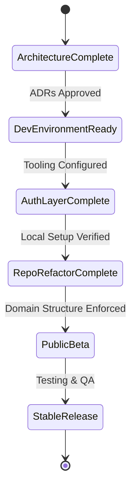
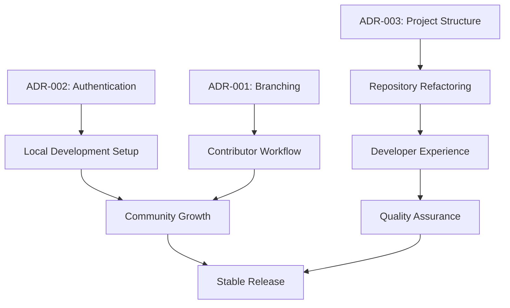
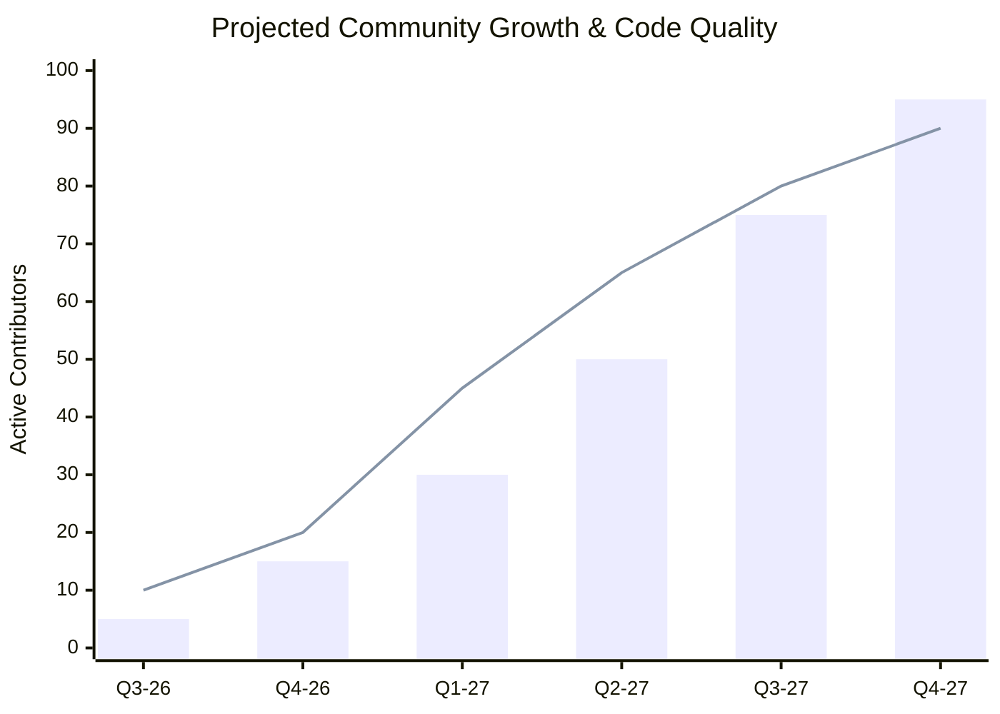

# CODEXEDOC Engineering Roadmap

## Introduction

The CODEXEDOC Engineering Roadmap serves as the definitive guide for the technical evolution of the platform. Unlike traditional educational platforms that merely serve content, CODEXEDOC is building an ecosystem where users create, organize, review, and master their own knowledge. As we transition from a small core team to a large, community-driven open-source platform, this roadmap outlines how we will scale our technical foundations, manage our architecture, and foster a thriving contributor community.

The philosophy underpinning this roadmap is rooted in **architecture before implementation** and **incremental development**. We recognize that large-scale rewrites are highly disruptive and often lead to project stagnation. Instead, our focus is on continuous improvement delivered through small, manageable Pull Requests. By defining clear architectural boundaries (as established in our ADRs) before writing code, we ensure that every incremental change contributes to a robust, scalable, and maintainable whole. This roadmap is a living document, designed to adapt as the project grows while remaining steadfast to our core engineering principles.

## Long-Term Vision

Our long-term vision for CODEXEDOC is to become the premier open-source ecosystem for personal and collaborative knowledge mastery. To achieve this, our engineering efforts are focused on the following pillars:

*   **Scalability:** The platform must gracefully handle exponential growth in users, data, and community contributions. Our architecture must support horizontal scaling, efficient data retrieval, and robust state management.
*   **Developer Experience (DX):** A frictionless development environment is paramount. We aim for a "zero-configuration" local setup, fast iteration cycles, and comprehensive tooling that empowers contributors to focus on solving problems rather than fighting the environment.
*   **Contributor Experience:** Beyond DX, we envision a welcoming, transparent, and structured journey for every contributor. From their first "good first issue" to becoming a Core Maintainer, the process must be clear, rewarding, and fair.
*   **Maintainability:** Code is read far more often than it is written. We prioritize clean code, comprehensive documentation, and strict adherence to architectural boundaries to ensure the codebase remains approachable and understandable for years to come.
*   **Community Growth:** Technical decisions should actively remove barriers to entry. By abstracting sensitive infrastructure (like production authentication) and providing a robust "Community Mode," we enable global participation without compromising security.
*   **Extensibility:** The core platform should be lean, providing powerful APIs and extension points that allow the community to build custom workflows, integrations, and tools on top of the CODEXEDOC foundation.

## Guiding Engineering Principles

Our engineering culture is defined by these core principles, which govern every technical decision and Pull Request.

*   **Single Source of Truth:** State, configuration, and documentation must have a single, authoritative source. Duplication leads to inconsistency and bugs. This applies to UI state management, database schemas, and project documentation alike.
*   **Documentation First:** Documentation is not an afterthought; it is a prerequisite. Architectural decisions (ADRs), API contracts, and complex logic must be documented before or alongside the implementation. If it isn't documented, it doesn't exist.
*   **Architecture Before Features:** We do not build features in a vacuum. Every new capability must be evaluated against our architectural guidelines. Foundational systems (like authentication or domain boundaries) must be solid before building user-facing features on top of them.
*   **Security by Default:** Security is a continuous process, not a checkbox. We adhere to the principle of least privilege, sanitize all inputs, and decouple development environments from production infrastructure (as seen in our Authentication Abstraction).
*   **Developer Experience:** A slow or complex local environment is a bug. We invest heavily in DX tooling, fast builds, clear error messages, and automated formatting to keep the development loop tight and enjoyable.
*   **Incremental Refactoring:** We reject "big bang" rewrites. Technical debt is managed through continuous, incremental refactoring (the "Boy Scout Rule": leave the code better than you found it). Refactoring should be decoupled from feature work into small, focused PRs.
*   **High Cohesion:** Code that changes together should live together. We organize our codebase by business domain (Domain-Driven Design), ensuring that related logic, UI components, and state are co-located.
*   **Low Coupling:** Modules and domains should interact through well-defined interfaces, not internal implementation details. This minimizes the blast radius of changes and allows components to be tested and evolved independently.
*   **Community Driven:** Technical decisions must consider the impact on open-source contributors. We prioritize standard tooling, avoid proprietary lock-in where possible, and ensure the project can be run locally by anyone, anywhere.
*   **Automation:** If a task must be done more than twice, automate it. This includes testing, linting, deployment, and contributor workflows (e.g., automated PR labeling, issue triage).
*   **Testing:** Automated tests are the safety net that enables rapid iteration. We prioritize integration tests for critical paths and unit tests for complex business logic, ensuring confidence in every release.
*   **Continuous Improvement:** We are never "done." We continuously evaluate our processes, tools, and architecture, seeking feedback from the community to iteratively improve the CODEXEDOC ecosystem.

## Roadmap Phases

The evolution of CODEXEDOC is structured into sequential phases. While some work may happen in parallel, these phases represent our overarching priorities.

### Phase 1: Architecture Foundation
*   **Purpose:** Establish the core architectural rules and documentation that will guide all future development.
*   **Objectives:** Finalize ADRs for branching, project structure, authentication, and contributor workflows.
*   **Deliverables:** Approved ADR-001 through ADR-004, foundational project structure documentation.
*   **Dependencies:** Core team consensus.
*   **Risks:** Analysis paralysis; spending too much time planning without execution.
*   **Success Metrics:** 100% of core architectural decisions documented and approved.
*   **Expected Outcomes:** A clear technical blueprint for the project.
*   **Future Improvements:** Continuous refinement of ADRs as new challenges arise.

### Phase 2: Development Environment
*   **Purpose:** Create a frictionless local development experience for all contributors.
*   **Objectives:** Implement a standard, containerized (or easily reproducible) local setup. Automate linting and formatting.
*   **Deliverables:** `CONTRIBUTING.md` guide, standardized local database setup, automated code quality checks (pre-commit hooks, CI pipelines).
*   **Dependencies:** Phase 1 (Architecture Foundation).
*   **Risks:** Complex setups that deter new contributors.
*   **Success Metrics:** Time from `git clone` to running app is under 5 minutes.
*   **Expected Outcomes:** High contributor retention and reduced onboarding friction.
*   **Future Improvements:** Cloud-based development environments (e.g., GitHub Codespaces).

### Phase 3: Authentication Layer
*   **Purpose:** Implement the robust authentication abstraction defined in ADR-002.
*   **Objectives:** Decouple the app from specific providers. Implement 'Community Mode' (mocked auth/local DB) and 'Core Mode' (staging credentials).
*   **Deliverables:** Authentication abstraction interface, local authentication provider, updated staging/production configurations.
*   **Dependencies:** Phase 2 (Development Environment).
*   **Risks:** Security vulnerabilities during implementation; complex local setup.
*   **Success Metrics:** Community contributors can run the full app locally without needing production API keys.
*   **Expected Outcomes:** A secure, scalable, and open-source friendly authentication architecture.
*   **Future Improvements:** Support for additional enterprise identity providers (SAML/SSO).

### Phase 4: Repository Refactoring
*   **Purpose:** Reorganize the existing codebase to align with the domain-driven project structure defined in ADR-003.
*   **Objectives:** Move away from technical folders (e.g., all components in one folder) to domain-centric modules under `src/domains/` (e.g., `src/domains/goals`, `src/domains/knowledge`).
*   **Deliverables:** A restructured `src/` directory, updated import paths, deprecated legacy structures.
*   **Dependencies:** Phase 1 (Architecture Foundation).
*   **Risks:** Merge conflicts with ongoing feature work; breaking existing functionality.
*   **Success Metrics:** 100% of new code adheres to the domain structure; zero legacy folder imports.
*   **Expected Outcomes:** Improved code discoverability, higher cohesion, and lower coupling.
*   **Future Improvements:** Automated tooling to enforce strict module boundaries.

### Phase 5: Developer Experience
*   **Purpose:** Elevate the internal tooling to accelerate feature development.
*   **Objectives:** Implement comprehensive UI component libraries (e.g., Storybook), standardize state management patterns, and improve error monitoring.
*   **Deliverables:** A documented design system, standardized data fetching hooks, integrated local logging.
*   **Dependencies:** Phase 4 (Repository Refactoring).
*   **Risks:** Over-engineering internal tools at the expense of user features.
*   **Success Metrics:** 30% reduction in time to merge for feature Pull Requests.
*   **Expected Outcomes:** Faster iteration cycles and a more enjoyable development process.
*   **Future Improvements:** Custom CLI tools for scaffolding new domains or components.

### Phase 6: Quality Assurance
*   **Purpose:** Solidify the platform's reliability through automated testing and CI/CD enhancements.
*   **Objectives:** Achieve high test coverage on critical paths, implement End-to-End (E2E) testing, and establish automated performance regressions checks.
*   **Deliverables:** Playwright/Cypress E2E test suite, GitHub Actions CI/CD pipelines enforcing test coverage, performance budgets.
*   **Dependencies:** Phase 5 (Developer Experience).
*   **Risks:** Flaky tests slowing down the CI pipeline.
*   **Success Metrics:** Zero P0/P1 bugs in production over a 3-month period; 100% CI pass rate on `main`.
*   **Expected Outcomes:** High confidence in deployments and a stable platform for users.
*   **Future Improvements:** Automated accessibility (a11y) testing.

### Phase 7: Community Growth
*   **Purpose:** Scale the contributor base and empower the community to take ownership of project areas.
*   **Objectives:** Implement the contributor workflow (ADR-004), establish clear paths to Core Maintainer status, and improve issue triage automation.
*   **Deliverables:** Automated PR labeling/routing, structured contributor ladder documentation, community community calls/showcases.
*   **Dependencies:** Phase 2, Phase 3, Phase 6.
*   **Risks:** Maintainer burnout; inconsistent code quality from rapid community growth.
*   **Success Metrics:** 50+ active monthly contributors; average PR review time under 48 hours.
*   **Expected Outcomes:** A vibrant, self-sustaining open-source ecosystem.
*   **Future Improvements:** Dedicated community advocacy and structured mentorship programs.

### Phase 8: Future Expansion
*   **Purpose:** Extend the platform's capabilities through advanced features and extensibility.
*   **Objectives:** Develop a public API, support third-party integrations, and explore advanced knowledge organization features (e.g., AI-assisted categorization).
*   **Deliverables:** Documented public REST/GraphQL API, plugin architecture, advanced feature sets.
*   **Dependencies:** Phase 6 (Quality Assurance), Phase 7 (Community Growth).
*   **Risks:** Feature bloat; degrading core performance.
*   **Success Metrics:** Launch of 5+ third-party integrations; high API adoption rate.
*   **Expected Outcomes:** CODEXEDOC becomes an extensible platform, not just an application.
*   **Future Improvements:** Decentralized knowledge sharing protocols.

## Milestones

*   **Architecture Complete:** All foundational ADRs (001-004) are finalized and merged.
*   **Community Environment Ready:** `CONTRIBUTING.md` is complete, and a new developer can run the app locally in under 5 minutes.
*   **Authentication Layer Complete:** The authentication abstraction is implemented, enabling Community Mode without production keys.
*   **Repository Refactor Complete:** The codebase is fully migrated to a domain-driven structure.
*   **Developer Documentation Complete:** Core APIs, state management patterns, and the design system are fully documented.
*   **Contributor Workflow Ready:** Automated issue triage and PR templates are active; the contributor ladder is published.
*   **Public Beta:** The platform is stable, feature-complete for the core use case, and open for broader user adoption.
*   **Stable Release (v1.0):** Enterprise-grade stability, comprehensive test coverage, and a thriving contributor community.

## Technical Debt Strategy

Technical debt is an inevitable byproduct of software development, but it must be managed proactively.

*   **Identification:** Debt should be identified during code reviews and logged as explicit GitHub Issues labeled `tech-debt`.
*   **Prioritization:** We allocate a fixed percentage (e.g., 20%) of engineering capacity per cycle to address technical debt, prioritizing debt that impedes feature development or introduces security risks.
*   **Refactoring:** Refactoring must happen in small, isolated Pull Requests. We do not mix feature development with broad refactoring to ensure PRs remain easy to review and revert if necessary.
*   **Architecture Drift:** To prevent the codebase from drifting away from our established ADRs, we utilize automated dependency analysis tools and strictly enforce architectural boundaries during code review. Any proposed deviation requires a new ADR or an amendment to an existing one.

## Risk Management

*   **Architecture Drift:** Managed by strict code review processes and treating ADRs as binding contracts. Automated tools will eventually enforce import boundaries.
*   **Large Pull Requests:** PRs over 400 lines of code (excluding auto-generated files) are discouraged and may be rejected. We mandate breaking large features into smaller, verifiable units.
*   **Outdated Documentation:** Documentation is tied to the code. A PR that changes system behavior is not complete until the accompanying documentation is updated in the same PR.
*   **Security Risks:** Addressed via the Authentication Abstraction (preventing leak of production keys), automated dependency scanning (Dependabot), and adhering to the principle of least privilege.
*   **Community Fragmentation:** Mitigated by transparent decision-making (ADRs), regular community updates, and a clear, fair contributor promotion path.
*   **Repository Complexity:** Managed through Domain-Driven Design (high cohesion, low coupling) and maintaining a lean core architecture.

## Architecture Evolution

Over the next several years, CODEXEDOC will evolve without complete rewrites through a strategy of **strangler patterns and interface segregation**. By strictly adhering to dependency inversion and abstracting core services (like database access and authentication), we can swap underlying implementations (e.g., moving from a monolithic database to specialized datastores) without affecting the UI or business logic. Our domain-driven structure allows us to extract highly utilized domains into separate microservices if horizontal scaling demands it, while keeping the majority of the application in a manageable modular monolith.

## Success Metrics

Engineering success is quantified by:

1.  **Lead Time for Changes:** Time from commit to production (Target: < 1 hour).
2.  **Deployment Frequency:** How often we release (Target: Multiple times a week).
3.  **Time to Restore Service:** How quickly we recover from a failure (Target: < 30 minutes).
4.  **Change Failure Rate:** Percentage of deployments causing failures (Target: < 2%).
5.  **Time to First PR:** Average time it takes a new contributor to submit their first PR (Target: < 1 week).
6.  **Code Coverage:** Percentage of critical paths covered by automated tests (Target: > 85%).
7.  **PR Size:** Average lines of code per PR (Target: < 250 LOC).

## Best Practices

1.  **Write code for humans first, machines second.** Readability is paramount.
2.  **Always leave the code cleaner than you found it.** (The Boy Scout Rule)
3.  **Prefer composition over inheritance.**
4.  **Keep functions small and focused on a single responsibility.**
5.  **Use descriptive variable and function names. Avoid abbreviations.**
6.  **Document the *why*, not the *what*, in inline comments.**
7.  **Fail fast and loudly.** Catch errors as close to the source as possible.
8.  **Do not commit commented-out code.** Use Git for history.
9.  **Write tests before fixing a bug.** (Test-Driven Bug Fixing)
10. **Keep Pull Requests small and narrowly scoped.**
11. **Review code with empathy and respect.**
12. **Automate repetitive tasks in your local environment.**
13. **Never hardcode secrets or environment-specific values.**
14. **Use strongly typed interfaces wherever possible.**
15. **Avoid deep nesting and complex conditional logic.**
16. **Handle all edge cases and loading states in the UI.**
17. **Optimize for performance only when data proves it is a bottleneck.**
18. **Keep the dependency tree lean. Don't add a library for a simple function.**
19. **Follow standard formatting conventions (use the provided linter/formatter).**
20. **Design APIs with backward compatibility in mind.**
21. **Use domain language (Ubiquitous Language) in code naming.**
22. **Ensure UI components are accessible (a11y) by default.**
23. **Sanitize and validate all user inputs at the boundary.**
24. **Use feature flags for incomplete or experimental features.**
25. **Log meaningful error messages that aid in debugging.**
26. **Decouple side effects from core business logic.**
27. **Avoid global state whenever possible.**
28. **Ensure local development matches production as closely as possible.**
29. **Update documentation in the same PR as the code change.**
30. **Ask for help early if you are stuck.**

## Anti-Patterns

*   **The "Big Bang" Rewrite:** Attempting to rewrite the entire application from scratch instead of incrementally refactoring. *Avoidance: Enforce the Boy Scout rule and small PRs.*
*   **God Classes/Modules:** Creating massive files or classes that handle everything. *Avoidance: Strict adherence to Domain-Driven Design and single responsibility principles.*
*   **Development by Console.log:** Relying solely on manual debugging instead of automated tests. *Avoidance: Mandate tests for new features and bug fixes.*
*   **Documentation as an Afterthought:** Writing docs only when a feature is "finished" (or never). *Avoidance: Block PR merges if documentation is missing or outdated.*
*   **Vendor Lock-in at the Core:** Tying business logic directly to a specific third-party service. *Avoidance: Use interfaces and dependency injection (e.g., Auth Abstraction).*
*   **"Works on My Machine":** Having a complex, undocumented local setup that fails for others. *Avoidance: Containerization and a strict `CONTRIBUTING.md` guide.*

## Mermaid Diagrams

### Roadmap Timeline

```mermaid
gantt
    title CODEXEDOC Engineering Roadmap Timeline
    dateFormat  YYYY-MM-DD
    section Foundation
    Phase 1: Architecture     :done,    des1, 2026-07-01, 2026-07-15
    Phase 2: Dev Environment  :active,  des2, 2026-07-15, 2026-08-15
    section Core Infrastructure
    Phase 3: Auth Layer       :         des3, 2026-08-15, 2026-09-15
    Phase 4: Repo Refactor    :         des4, 2026-09-15, 2026-10-30
    section Scaling
    Phase 5: Dev Experience   :         des5, 2026-11-01, 2026-12-15
    Phase 6: Quality Assurance:         des6, 2026-12-15, 2027-02-01
    Phase 7: Community Growth :         des7, 2027-02-01, 2027-04-01
    Phase 8: Future Expansion :         des8, 2027-04-01, 2027-06-01
```

### Architecture Evolution

```mermaid
flowchart TD
    subgraph Current State
    A[Monolithic Frontend] --> B[Direct Provider Integrations]
    A --> C[Scattered Domain Logic]
    end

    subgraph Intermediate Phase
    D[Modular Monolith] --> E[Auth Abstraction Interface]
    D --> F[Domain-Driven Modules]
    E --> G[Mock Providers / Local DB]
    E --> H[Production Providers]
    end

    subgraph Future Vision
    I[Core App] --> J[Extensible API Gateway]
    I --> K[Strict Domain Boundaries]
    J --> L[Microservices / Plugins]
    end

    Current State -.Refactor.-> Intermediate Phase
    Intermediate Phase -.Scale.-> Future Vision
```

### Milestone Flow



### Dependency Graph



### Project Growth


